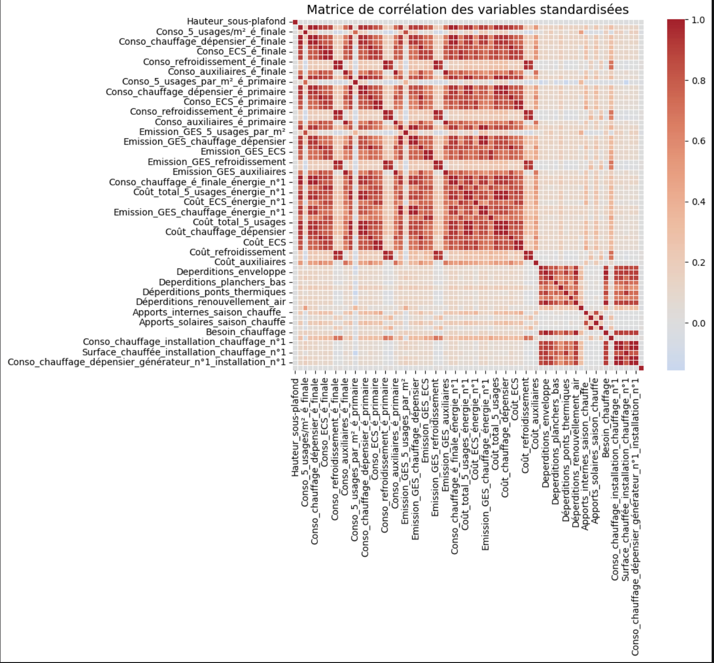
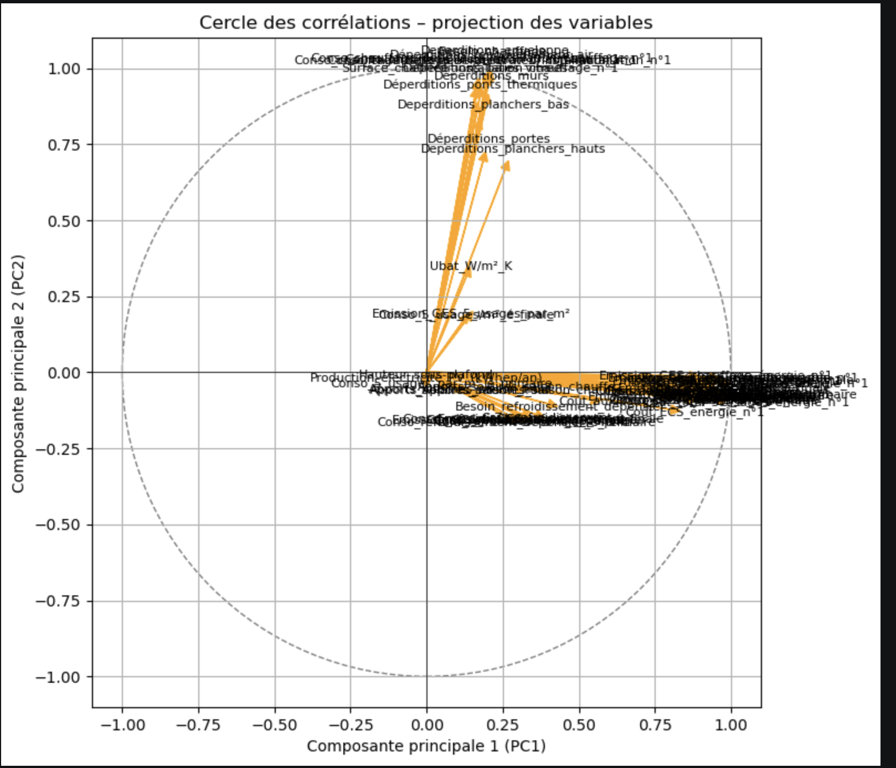
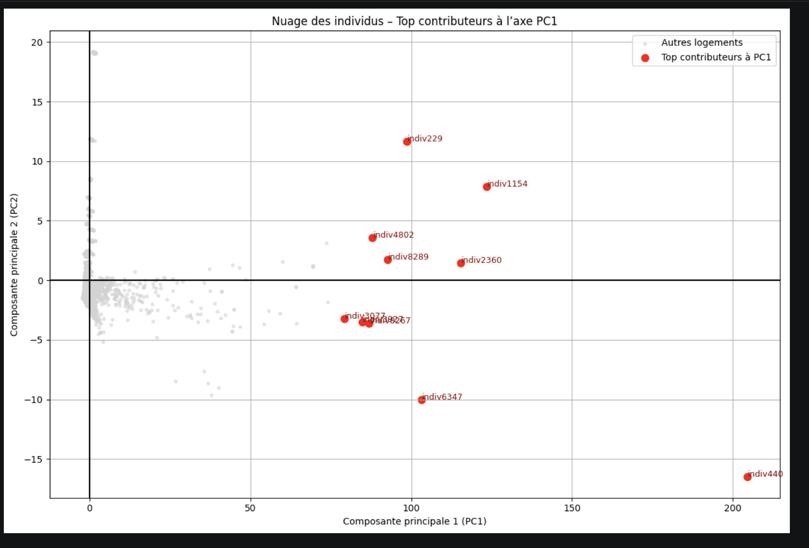

# Multivariate Analysis and Predictive Modeling

## Overview

Academic project completed as part of the Bachelor's Degree in Data Science (BUT Science des Données).

The objective of this project was to explore relationships between quantitative variables, identify correlation structures, and perform dimensionality reduction using Principal Component Analysis (PCA).

## Objectives

* Explore and clean the dataset
* Analyze relationships between variables
* Identify highly correlated variables
* Reduce dimensionality using PCA
* Interpret principal components and factor maps
* Visualize statistical relationships

## Methodology

* Data preprocessing and standardization
* Correlation matrix analysis
* Principal Component Analysis (PCA)
* Correlation circle visualization
* Individual factor map analysis
* Interpretation of statistical results

## Technologies

* Python
* Pandas
* NumPy
* Scikit-Learn
* Matplotlib
* Jupyter Notebook

## Skills Developed

* Data Analysis
* Exploratory Data Analysis (EDA)
* Principal Component Analysis (PCA)
* Statistical Modeling
* Data Visualization
* Feature Reduction

## Visualizations

### Correlation Matrix

### Correlation Circle

### Individual Factor Map

## Author

Abou Diop

BUT Science des Données – Université Sorbonne Paris Nord
